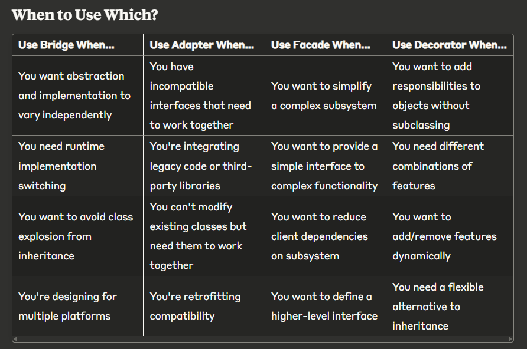

## Structural Design Pattern

These patterns are concerned with objects relationships and structure of classes or objects. They are useful when *Adding new functionality* without having to modify the entire system. Only part of the system changes. 

Types of Structural Design patterns
1. Decorator 
2. Facade
3. Adaptor
4. Bridge
5. Composite
6. Flyweight
7. Proxy

## Bridge Pattern

Intent: "Decouple abstraction from implementation so both can vary independently"
Example: Drawing shapes (abstraction) with different graphics APIs (implementation)
Benefit: Platform independence, runtime implementation switching

## Adapter Pattern

Intent: "Convert interface of a class into another interface clients expect"
Example: Using legacy payment processor with modern payment interface
Benefit: Reuse existing code with incompatible interfaces

## Facade Pattern

Intent: "Provide unified interface to set of interfaces in subsystem"
Example: Home theater system with simple "watch movie" method
Benefit: Hide complexity, easier to use subsystem

## Decorator Pattern

Intent: "Attach additional responsibilities to object dynamically"
Example: Adding milk, sugar, whip to coffee
Benefit: Flexible alternative to subclassing for extending functionality

When to Use Which?

## Real-World Analogies

Bridge: TV remote (abstraction) works with different TV brands (implementations)
Adapter: Power plug adapter for different countries
Facade: Hotel concierge (simple interface to complex hotel services)
Decorator: Customizing pizza with toppings, or dressing up with accessories
