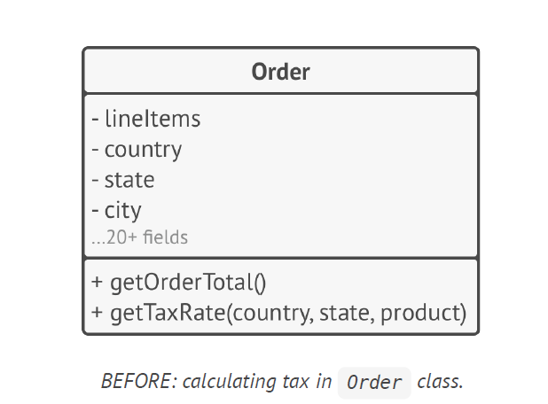
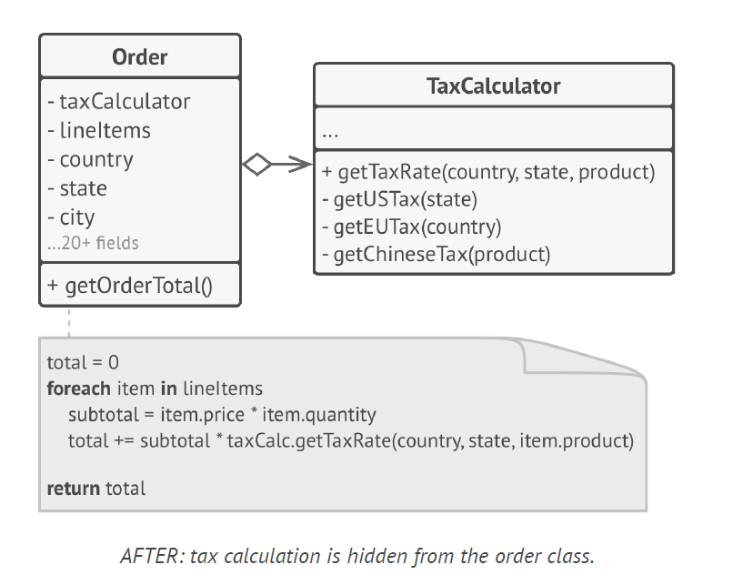

## Encapsulation of methods
lot of if else conditions inside the main method, it can useful to encapsulate all the conditions in one method

## Encapsulation of Classes

lot of functionality to single method it is better to capture everything inside single class

