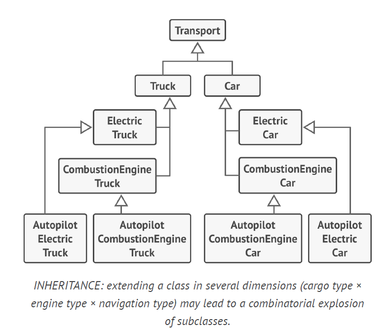
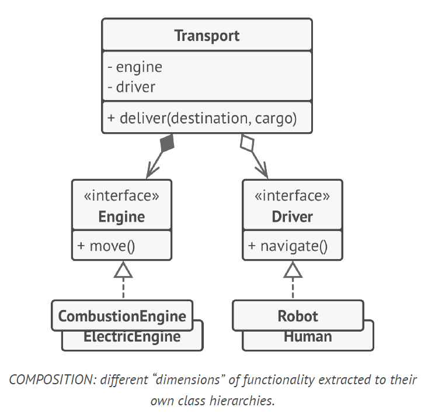

## Favor composition over Inheritance

1. ***A subclass can’t reduce the interface of the superclass***. You have to implement all abstract methods of the parent class even if you won’t be using them.
2. ***When overriding methods you need to make sure that the new behavior is compatible with the base one.*** It’s important because objects of the subclass may be passed to any code that expects objects of the superclass and you don’t want that code to break.
3. ***Inheritance breaks encapsulation of the superclass because the internal details of the parent class become available to the subclass.*** OR a superclass is aware of some details of subclasses for the sake of making further extension easier.
4. ***Subclasses are tightly coupled to superclasses.*** Any change in a superclass may break the functionality of subclasses.
5. ***Trying to reuse code through inheritance can lead to creating parallel inheritance hierarchies.***you have to create lots of class combinations, bloating the class hierarchy to a ridiculous size.

Whereas inheritance represents the “is a” relationship between classes (a car is a transport), composition represents the “has a” relationship (a car has an engine).
Aggregation is mild composition - a car has a driver, but he or she may use another car or just walk without the car.

There’s a lot of duplicate code between subclasses because a subclass can’t extend two classes at the same time.You can solve this problem with composition. One can replace an engine object linked to a car object just by assigning a different engine object to the car.

### Multilevel Inheritance
Pure Virtual Functions:
.
These are declared with = 0 in the base class (e.g., virtual void func() = 0;). Any concrete (non-abstract) class inheriting from a class with pure virtual functions must provide an implementation for them.
Regular Virtual Functions:
.
These have a default implementation in the base class. Derived classes can override them to provide specific behavior, but they are not required to do so. If a derived class does not override a regular virtual function, it will inherit the base class's implementation.

In multilevel inheritance, a derived class is only obligated to implement pure virtual functions from its parent classes (or any ancestor class). If a class inherits a pure virtual function and does not provide an implementation for it, that class itself becomes an abstract class and cannot be instantiated.