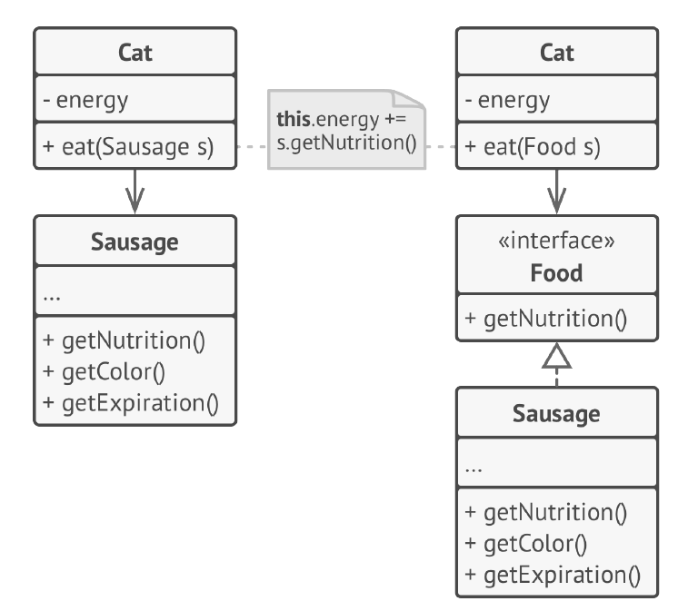
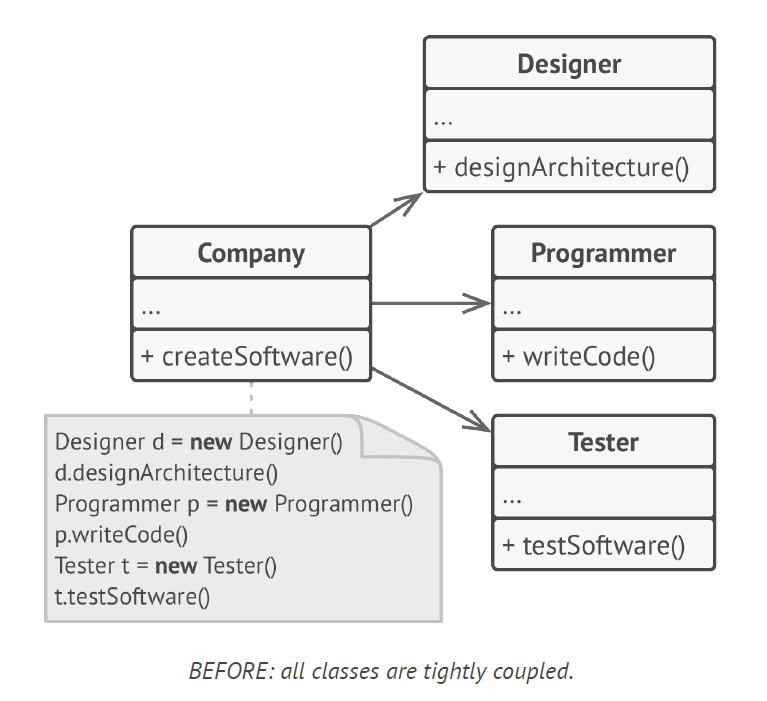
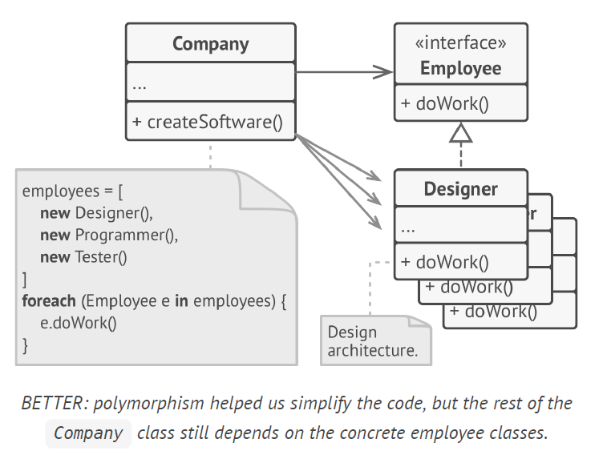
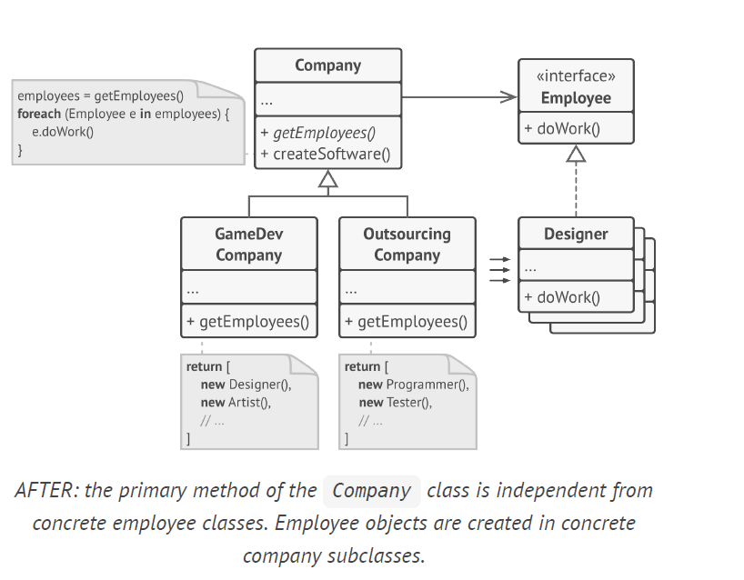

## Interface / Abstraction / Polymorphism

When you want to make two classes collaborate, you can start by making one of them dependent on the other.

1. Determine what exactly one object needs from the other: which methods does it execute?
2. Describe these methods in a new interface or abstract class.
3. Make the class that is a dependency implement this interface.
4. Now make the second class dependent on this interface rather than on the concrete class. You still can make it work with objects of the original class, but the connection is now much more flexible.

When is Interface beneficial ? 
classes that are tightly coupled to concrete classes as below

we can apply polymorphism inside the Company class, treating various employee objects via the Employee interface.The Company class remains coupled to the employee classes. This is bad because if we introduce new types of companies that work with other types of employees, we’ll need to override most of the Company class instead of reusing that code.

**+getEmployees is an abstract method** This is factory method where the Company class is not directly coupled with the concrete classes of Designer, Architect employee as seen above where we create an instance of each employee in the list of employees. We call an abstract method getEmployees and depending on subclasses GameDev / Outsourcing company we cabn define the employee type. Hence the superclass Company is not associated with the employees but the subclasses are associated with the individual employee classes. 

