## OOP fundamentals 
-> A class is like a blueprint that defines the structure for objects, which are concrete instances of that class.

-> Subclasses inherit state and behavior from their parent, defining only attributes or behaviors that differ.

-> Subclasses can override the behavior of methods that they inherit from parent classes. A subclass can either completely replace the default behavior or just enhance it with some extra stuff.

-> a constructor must always return new objects by definition. It can’t return existing instances.

-> public variables are accessible from anywhere outside the class using the object of the class.

->private variables- only accessible from within of the methods of its own class. It cannot be accessed or modified directly by derived classes or external code.(encapsulation)

-> protected variables - accessible from within of the methods of its own class and makes a member of class available to inheritance / subclasses as well. It is less restrictive than private.It cannot be accessed by external code that is not part of the class hierarchy.
Getters and setters are used for both protected and private variables, but for different reasons:

For protected members (like in our Shape class Prototype pattern):

They provide a consistent interface even if internal implementation changes
They allow derived classes to directly access the members while still maintaining encapsulation for external users
They can add validation or logging if needed in the future

For private members (like width/height in Rectangle):

They are essential since private members can't be accessed directly by anyone except the class itself
They provide complete encapsulation
They allow the class to control how its data is accessed and modified

-> (Encapsulation) Interface and protocol keywords are used to define contracts of interaction between objects.

-> Association is a type of relationship in which one object uses or interacts with another. In UML diagrams the association relationship is shown by a simple arrow drawn from an object and pointing to the object it uses. We can have bidirectional association. 

-> Dependency is a weaker variant of association that usually implies that there’s no permanent link between objects.Dependency typically (but not always) implies that an object accepts another object as a method parameter, instantiates, or uses another object.A dependency exists between two classes if changes to the definition of one class result in modifications in another class.

-> Composition - Composition is a “whole-part” relationship between two objects, one of which is composed of one or more instances of the other.The component can only exist as a part of the container. Department class has no existance without University Class.

-> Aggregation - Aggregation is a less strict variant of composition, where one object merely contains a reference to another.The container doesn’t control the life cycle of the component. The component can exist without the container and can be linked to several containers at the same time.

-> In C++, an interface is typically created using a pure abstract class where all methods are pure virtual (virtual functions = 0). Abstract classes can have both pure virtual functions and regular methods with implementations. Interfaces cannot have any method implementations or member variables (except static const).Interfaces typically don't have constructors (except default) Abstract classes can have constructors that are called by derived classes.

```
// Interface (pure abstract class)
class IShape {
public:
    virtual double getArea() = 0;     // pure virtual function
    virtual double getPerimeter() = 0;
    virtual ~IShape() {}              // virtual destructor
};

// Abstract class
class Shape {
public:
    virtual double getArea() = 0;     // pure virtual function
    virtual double getPerimeter() = 0;
    
    // Regular method with implementation
    void setColor(const std::string& color) {
        this->color = color;
    }
    
protected:
    std::string color;                // member variable
};

```
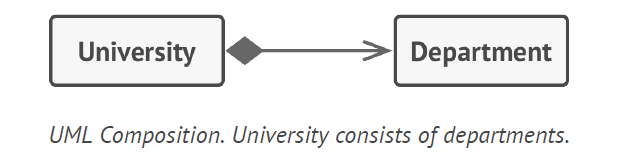, 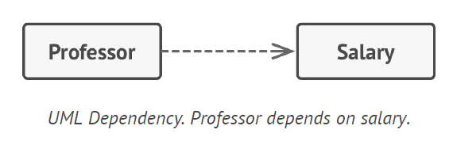, , 

## 4 Pillars of OOP

1. **ABSTRACTION** 

Abstraction is a model of a real-world object or phenomenon, limited to a specific context, which represents all details relevant to this context with high accuracy and omits all the rest. When declared any method as abstract, it forces all subclasses to implement their own versions of the method with same return type.

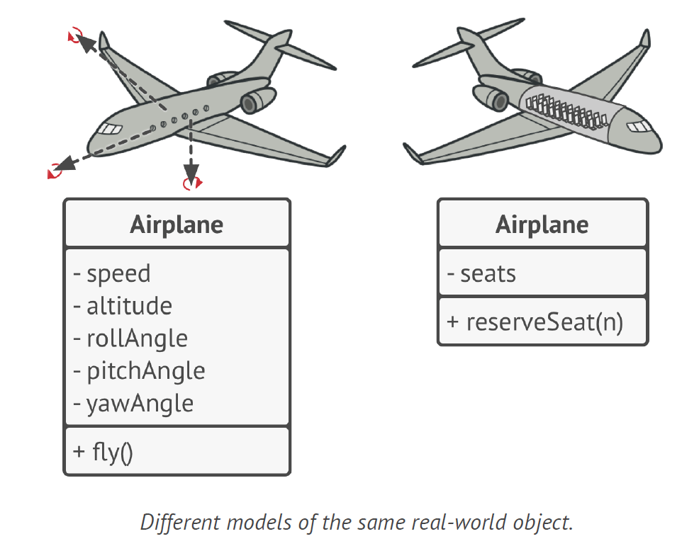

2. **INHERITANCE** 

Inheritance is the ability to build new classes on top of existing ones for code reusability. Implement all abstract methods, even if they don’t make sense for your subclass

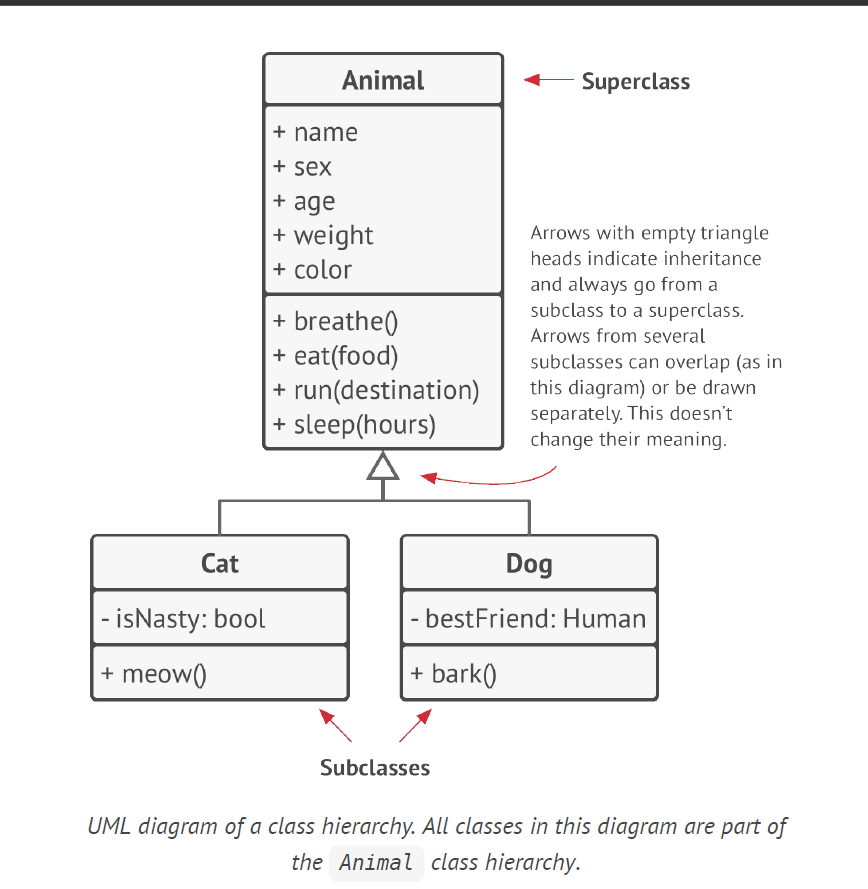

3. **POLYMORPHISM**

Polymorphism, the program can trace down the subclass of the object whose method is being executed and run the appropriate behavior.Polymorphism is the ability of a program to detect the real class of an object and call its implementation even when its real type is unknown in the current context, example - that all subclasses will need to override the base makeSound method so each subclass can emit the correct sound; therefore we can declare it abstract. 

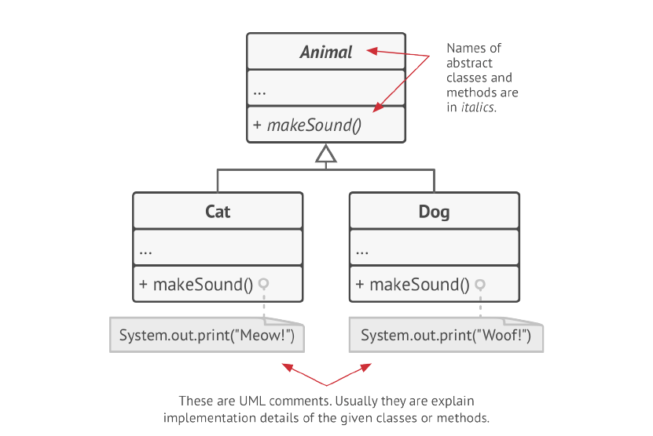

4. **ENCAPSULATION**

Encapsulation is the ability of the object to hide parts of its state and behaviors from other objects exposing only limited interface to rest of the program. Each object has an interface—a public part of an object, open to interactions with other objects.

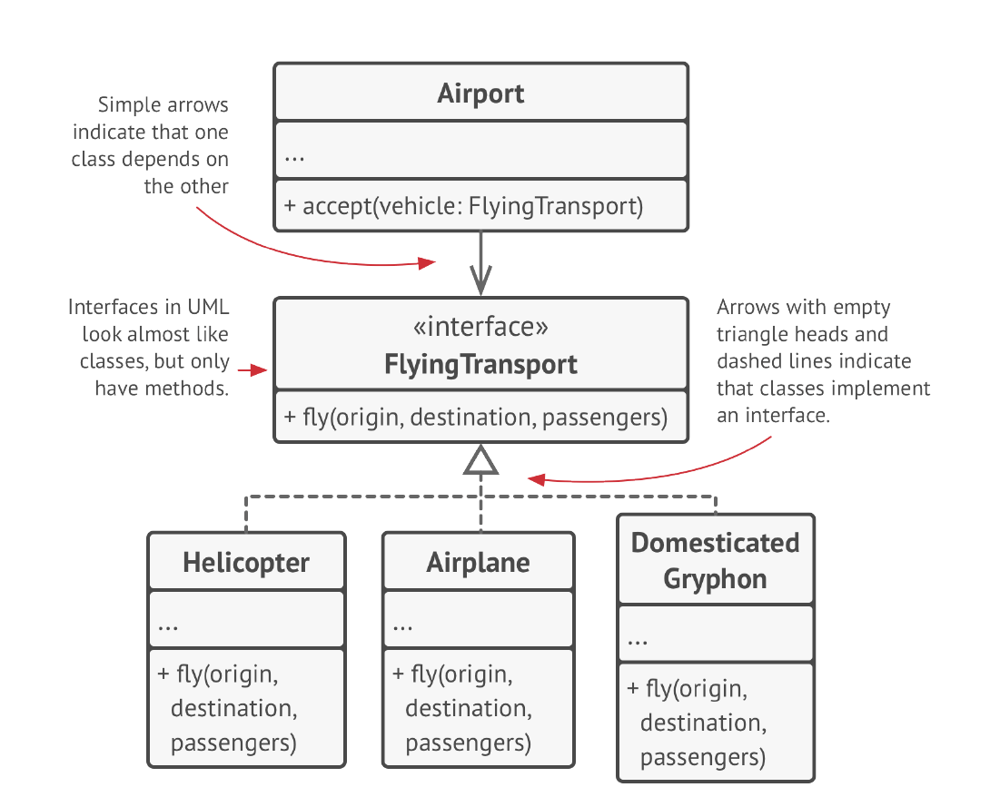

One class can only have single superclass however can have multiple interfaces.If a superclass implements an interface, all of its subclasses
must also implement it.

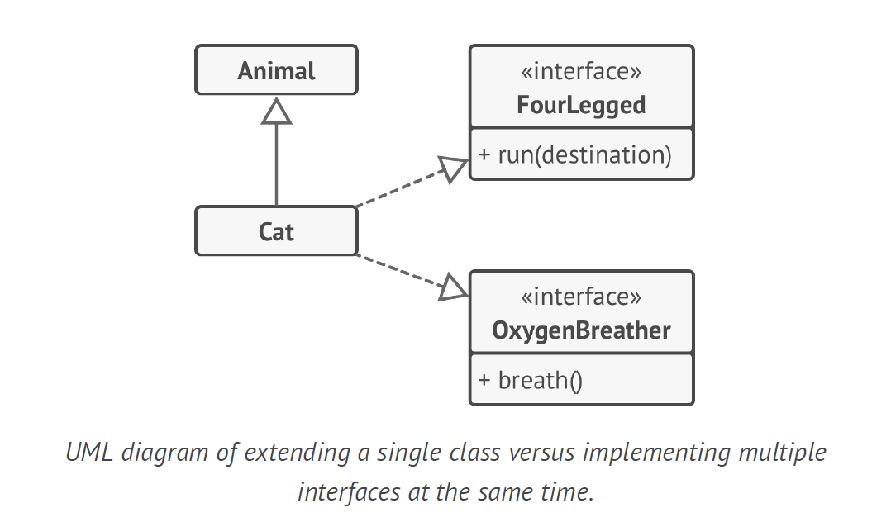

## Design Patterns overview

**Creational design patterns** - provide various object creation mechanisms that increase flexibility and reuse of existing code, these patterns are all about creating objects. 

**Structural design patterns** - these design patterns for composition of objects and classes. With Structural design patterns use inheritance to compose interfaces. These explain how to assemble objects and classes into larger structures. 

**Behavioral design patterns** - these patterns all about communication and the assignment of responsibilities between objects.


| Sr.No | Creational      |   Description                                                                                        |Examples           |Ways of Implemations|
|:----- | :-------------- |:----------------------------------------------------------------------------------------------------|:------------------|:-------------------|
|  1.   |Factory          | The factory method has common interface return type. It creates interface for creating objects in superclass (Logistics), allows subclass to alter type of objects to be created(roadLogistics return truck).The return type for above is common interface(Transport) |This factory method is overridden  in the subclasses that can change the product type created using new/ class.A common base class or interface is always implemented for all the products subclasses.| Factory method uses abstract or base factory method can return some default product. All subclasses may return different types of products only if these products have a common base class or interface. | 
|  2.   |Singleton        | The Singleton Pattern ensures  class has single instance while providing global access to that instance.| Make the default constructor private, to prevent other objects from using the new operator with the Singleton class. Create a static creation method that acts as a constructor. Under the hood, this method calls the private constructor to create an object and saves it in a static field. All following calls to this method return the cached object.| The Singleton class declares the static method getInstance that returns the same instance of its own class.|
|  3.   |Prototype        | Prototype is used to copy existing objects without making your code dependent on their classes. The Prototype pattern delegates the cloning process to common interface for all objects that support cloning.The clone method creates an object of the current class and carries over all of the field values of the old object into the new one.An object that supports cloning is called a prototype.|When your objects have dozens of fields and hundreds of possible configurations, cloning them might serve as an alternative to subclassing. A prototype class must define the alternative copy constructor that accepts an object of that class as an argument. The constructor must copy the values of all fields defined in the class from the passed object into the newly created instance.The clone method should return the object of the same class. | Use the Prototype pattern when your code shouldn’t depend on the concrete classes of objects that you need to copy.Use the pattern when you want to reduce the number of subclasses that only differ in the way they initialize their respective objects. Instead of instantiating a subclass that matches some configuration, the client can simply look for an appropriate prototype and clone it. |
|  4.   |Builder          | The Builder method produces different types and representations of an object using the same contruction code, reuse the same object construction code when building different types of products, such as cars, and create the corresponding manuals for them.           | This method is useful when you want your code to be able to create different representations of some product.To avoid initialization code buried inside a monstrous constructor with lots of parameters or scattered all over the client code. The program too complex by creating a subclass for every possible configuration of an object.|  To create an object, you execute a series of these steps on a builder interface object.The client code that calls the building steps is able to interact with builders using a common interface called Director.The director class defines the order in which to execute the building steps, while the builder provides the implementation for those steps.The Client must associate one of the builder objects with the director
|  5.   |Abstract Factory | Abstract factory method produces families of related objects without providing concrete classes |Abstract Factory pattern can be used for creating cross-platform UI elements without coupling the client code to concrete UI classes, while keeping all created elements consistent with a selected operating system. | It explicitly declare interfaces for each distinct product of the product family eg chair, sofa or coffee table and then all variants of products follow individual product interfaces. Then declare the Abstract Factory—an interface with a list of creation methods for all products that are part of the product family eg createChair, createCoffeetable. These methods must return abstract product types represented by the interfaces.We create a separate factory class based on the AbstractFactory interface.


| Sr.No | Structural      | Description| Examples | ways of Implementation
|:----- | :-------------- |:-------------|:-----------|:------------------------|
|  1.   | Adapter         |This pattern provides a unified interface that allows objects with incompatible interfaces to collaborate. |you can wrap an object that operates in meters and kilometers with an adapter that converts all of the data to imperial units such as feet and miles.|Use the Adapter class when you want to use some existing class, but its interface isn’t compatible with the rest of your code. To extend functionality of each subclass add it into adapter class  |
|  2.   | Bridge          |This pattern lets you split large class or set of closely related classes into 2 separate hierarchy - abstraction and implementation which are independent of each other.|             |
|  3.   | Composite       |This pattern lets you compose objects into tree structure and then work with these structures and work with these structures as if they were individual objects.       |       
|  4.   | Decorator       |This pattern lets you attach new behaviors to objects by placing these objects inside special wrapper objects that contain behaviors. |         |
|  5.   | Facade          |This pattern provides a simplified interface to a library , framework or any other complex set of classes. |        |
|  6.   | Flyweight       | This pattern lets you fit more objects into the available amount of RAM by sharing common parts of the state between multiple objects instead of keeping all of the data in each object. |         |
|  7.   | Proxy           | This pattern lets you provide a substitute or a placeholder for another object. A proxy controls access to the original object allowing you to perform something either before or after the request gets through to the orginal object. | 

| Sr.No | Behavioral      |     |   |
|:----- | :-------------- |:-------------:| -----------:|
|  1.   |       |               |             |
|  2.   |      |               |             |
|  3.   |        |               |       
|  4.   |         |               |         |
|  5.   | |               |        |
|  6.   |       |               |         |
## StudyPlan 

| No	| Name	| Resource | 	Page	| Status |
|:------|:------|:---------|:-----------|:-------|
| 1.	| Head First Design Patterns | link | 677	| ⌛ |
| 2.	| Elements of Reusable Object-Oriented Software | 	link |	417 |	⌛
| 3.	| Dive into Design Patterns | Dive into Design Patterns.pdf |	410	| 📖
| 4.	| Head First Object-Oriented Analysis and Design| link |603 |	⌛
| 5.	| Patterns of Enterprise Application Architecture| link |389 |	⌛


## Design Principals

 Encapsulate what varies - Identify the aspects of your application that vary and separate them from what stays the same. The main goal of this principle is to minimize the effect caused by changes.

**Single responsibility principal**  - Every class responsible for a single part of the functionality provided by the software, and make that responsibility entirely encapsulated.

**Open/Closed principal** - Keep existing code from breaking when you implement new features, A class is open if you can extend it, produce a subclass ,add new methods or fields,
override base behavior.You can introduce new variants of products without breaking existing client codeA class is open for features but closed for modifications.If a class is already developed, tested, reviewed, and included in some framework or otherwise used in an app, trying to mess with its code is risky. Instead of changing the code of the class directly, you can create a subclass and override parts of the original class that you want to behave differently. example strategy design pattern: **STRATEGY Design Pattern**

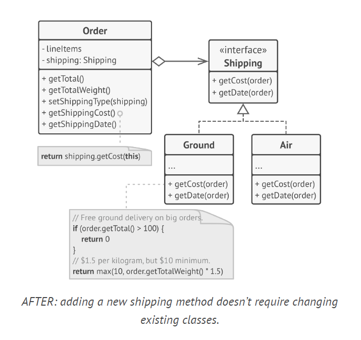

**Liskov Substitution Principal** - subclass should remain compatible with the behavior of the superclass, use overriding with similar behaviors.The substitution principle is a set of checks that help predict
whether a subclass remains compatible with the code that was able to work with objects of the superclass. This concept is critical when developing libraries and frameworks because your classes are going to be used by other people whose code
you can't directly access and change.

  a. Parameter types in a method of a subclass should match or be more abstract than parameter types in the method of the superclass.
  
  b.The return type in a method of a subclass should match or be a subtype of the return type in the method of the superclass.anti-example comes from the world of programming languages with dynamic typing: the base method returns a string, but the overridden method returns a number.
  
  c.A method in a subclass shouldn't throw types of exceptions which the base method isn't expected to throw.
  
  d.A subclass shouldn't strengthen pre-conditions.
  
  e. A subclass shouldn't weaken post-conditions.
  
  f. Invariants of a superclass must be preserved
  
  g. A subclass shouldn't change values of private fields of the superclass

  **Interface Segregation Class**

The interfaces is narrow enough that client classes don’t have to implement behaviors they don’t need. Not all clients can satisfy the requirements of the bloated interface.The better approach is to break down the interface into parts. Classes that are able to implement the original interface can now just implement several refined interfaces.Don’t further divide an interface which is already quite specific.

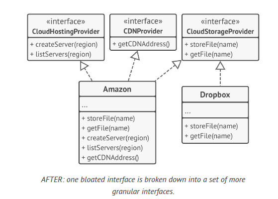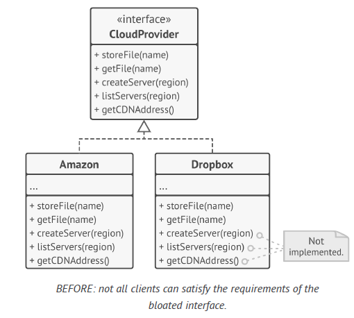

**Dependency Inversion Principal**

people design low-level classes first and only then start working on high-level ones. This is very common when you start developing a prototype on a new system, and you’re not even sure what’s possible at the higher level because low-level stuff isn’t yet implemented or clear. With such an approach business logic classes tend to become dependent on primitive low-level classes.The following steps should be done 
1. Describe interfaces for low-level operations that high-level classes rely on, preferably in business terms.
2. Make high-level classes dependent on those interfaces, instead of on concrete low-level classes.
3. Once low-level classes implement these interfaces, they become dependent on the business logic level, reversing the direction of the original dependency.

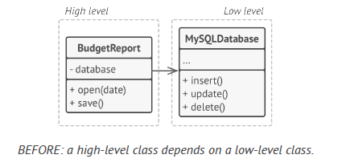 
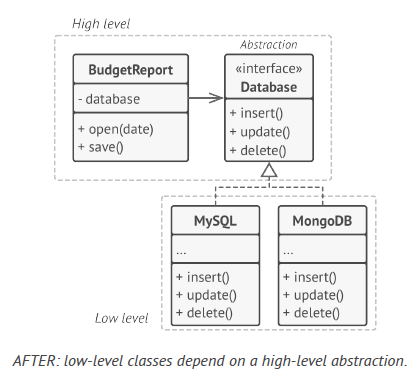 

## General notes

Many designs start by using Factory Method (less complicated and more customizable via subclasses) and evolve toward Abstract Factory, Prototype, or Builder (more flexible, but more complicated).  

Designs that make heavy use of Composite and Decorator can often benefit from using Prototype. Applying the pattern lets you clone complex structures instead of re-constructing them from scratch.

Abstract Factories, Builders and Prototypes can all be implemented as Singletons.

There should be only one Singleton instance, whereas a Flyweight class can have multiple instances with different intrinsic states.The Singleton object can be mutable. Flyweight objects are immutable.

## References

https://github.com/abbos0123/Design-Patterns/tree/main?tab=readme-ov-file

