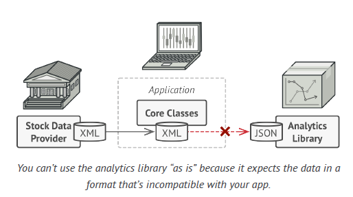
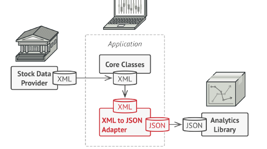
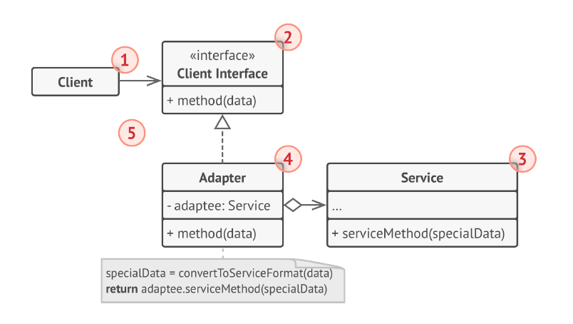
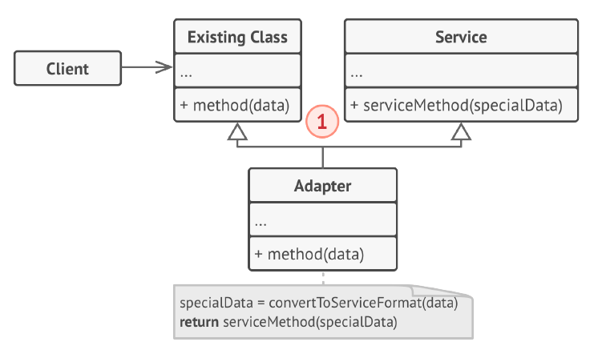

## Adapter design pattern

Adapter is a structural design pattern that allows objects of incompatible interfaces to collaborate.
 

### Object Adapter
This implementation uses the aggregation principle: the adapter implements the interface of one object and wraps the  other one.The Adapter is a class that’s able to work with both the client and the service: it implements the client interface, while wrapping the service object. The adapter receives calls from the client via the adapter interface and translates them into calls to the wrapped service object in a format it can understand.

 The Client is a class that contains the existing business logic of the program. The Client Interface describes a protocol that other classes must follow to be able to collaborate with the client code.The Service is some useful class (usually 3rd-party or legacy).The client can’t use this class directly because it has an incompatible interface.The client code doesn’t get coupled to the concrete adapter class as long as it works with the adapter via the client interface.This can be useful when the interface of the service class gets changed or replaced: you can just create a new adapter class without changing the client code.

### Class Adapter
This implementation uses inheritance principle: the adapter inherits interfaces from both the objects at the same time.(Multiple inheritance)
The Class Adapter doesn’t need to wrap any objects because it inherits behaviors from both the client and the service.

The adaptation happens within the overridden methods. The resulting adapter can be used in place of an existing client class.